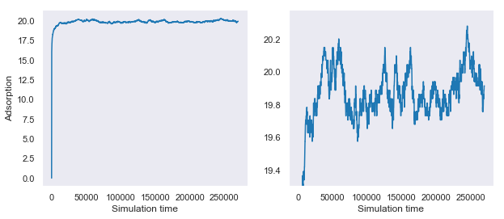
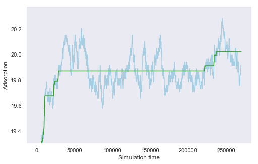
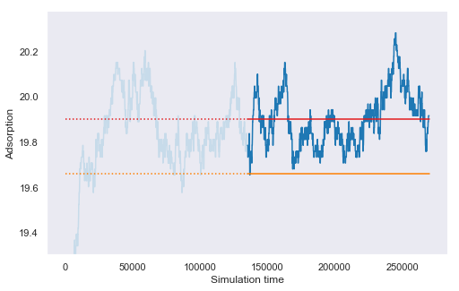
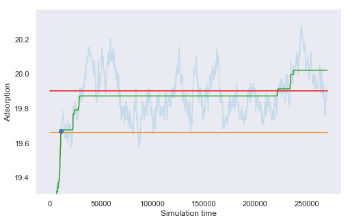
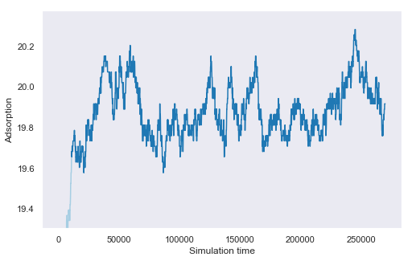

Equilibrium finding
===================

Each individual sampling point that is simulated will initially start with an empty system.
As the simulation progresses the system will gradually be filled with gas molecules until an equilibrium amount is reached.
Data can only be gathered from the system once equilibrium has been reached.

An example timeseries from a simulation is given below,
with the right hand panel showing a close up of the data.

This page details the algorithm which detects if and when a simulation has reached equilibrium.
This method attempts to find the earliest point in the timeseries where equilibrium has been reached.
It will also be responsible for detecting when equilibrium has not been reached.

Monotonic fit
"""""""""""""

Firstly,
a monotonic regression is fitted to the entire timeseries.
A monotonic regression can be thought of as
a rolling line of best fit which can only increase or remain constant, but never decrease.
As previously mentioned, the system initially starts at 0 and will rise to an equilibrium value,
therefore the monotonic fit provides a good model of the smoothed behaviour of the timeseries.

Estimating the mean and standard deviation
""""""""""""""""""""""""""""""""""""""""""

Secondly,
we take the final half of the timeseries and take the mean and standard deviation of this.
It is important to note that these values will not be correct estimates of the data,
but they are useful for identifying the equilibration point.

Finding the equilibration point
"""""""""""""""""""""""""""""""

We can then combine these two pieces of information together
to find where our model of the smoothed timeseries
first crosses our estimate of the lower bound of the data.
This interception is then proposed as the equilibration point,
with all values in the timeseries after this point to be used as data.

Checking our assumptions
""""""""""""""""""""""""

At this point we must check our hypothesis that this is the equilibration point.
To do this, an augmented Dickey-Fuller test is used to check if the timeseries
after the proposed equilibration point is stationary (ie flat).
If the timeseries is found to have statistically significant drift,
then the hypothesis is rejected and further simulation is required to gather data.
